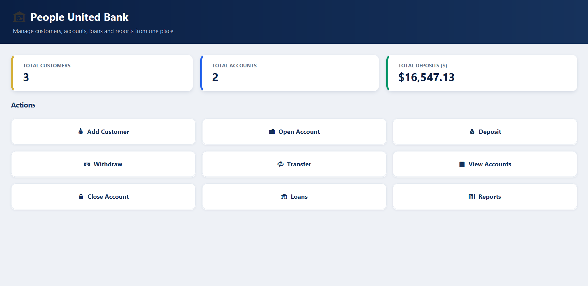
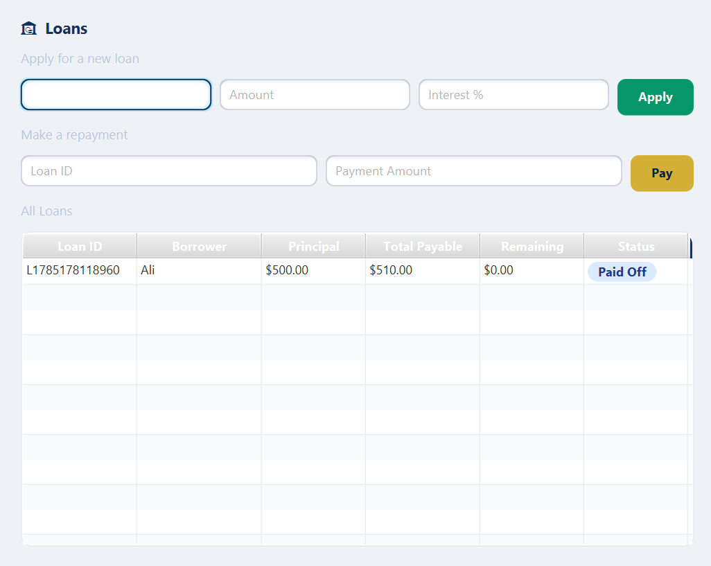
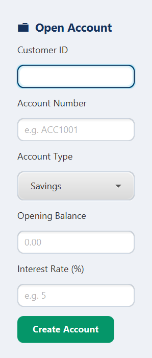

# Bank Account Management System (v2)

A JavaFX desktop application for managing customers, accounts, deposits,
withdrawals, transfers, loans and reports for a small bank — built as an
OOP semester project and then reworked into a more complete, portfolio-ready
version.
## Screenshots

**Dashboard**


**Loans**


**Open Account**


## What changed from the original submission

**Bugs fixed**
- `Bank.closeAccount()` never actually removed the account — the removal
  code sat after an unreachable `break`. Fixed and rewritten as `findAccount`
  + `closeAccount` with a proper `AccountNotFoundException`.
- `Transaction`'s constructor assigned the field to itself
  (`this.transactionID = transactionID;`) instead of the parameter, so every
  transaction ID was silently `null`. Fixed.
- Custom exceptions (`InvalidAmountException`, `InsufficientBalanceException`)
  were thrown and caught in the same method, so they never reached the UI.
  They now propagate up to the controllers, which display real error dialogs.

**Design improvements**
- `BankAccount` fields are now `private` (were `protected`), so subclasses
  go through the public API instead of touching balance/status directly.
- `Bank` is a proper singleton (`Bank.getInstance()`) instead of a public
  static field, and now has duplicate-ID / duplicate-account-number checks.
- Added `AccountNotFoundException` and `DuplicateEntryException` for
  clearer, more specific error handling.
- Every model class has a real `toString()` / details method instead of
  scattering `System.out.println` calls everywhere.

**New features**
- **Persistence** — the whole bank (customers, accounts, loans, reports) is
  serialized to `bankdata.ser` on close and reloaded on startup, so data
  survives restarting the app.
- **Loans module** — apply for a loan, see the monthly installment, and make
  repayments (`Loan.java`, `Loans.fxml`).
- **Reports module** — generate a live summary report of the bank's current
  state (`Reports.fxml`).
- **Transaction history** — every deposit/withdrawal is now actually
  recorded and viewable per-account.
- **Close account** screen, wired to the fixed `closeAccount` logic.
- **Search & sort** in the accounts table (by account number/owner name, or
  by balance), plus a one-click "Add Interest" action for savings accounts.
- Accounts are now shown in a `TableView` instead of a plain `TextArea`.
- A dashboard with live stats (total customers / accounts / deposits).

**UI/UX**
- All user-facing feedback (success and error messages) now shows in real
  dialogs (`AlertHelper`) instead of only printing to the console, which the
  compiled desktop app's user would never see.
- Basic input validation everywhere `Double.parseDouble` is used, so typing
  invalid text shows a friendly error instead of crashing.
- A shared `style.css` gives the whole app a consistent, modern look.

## Project structure

```
src/
  Bank.java, BankAccount.java, SavingsAccount.java, CurrentAccount.java,
  Customer.java, Transaction.java, Loan.java, BankStaff.java, Report.java
      -> core domain model
  Transferable.java, Printable.java, AccountBalanceComparator.java
      -> interfaces / comparator
  InvalidAmountException.java, InsufficientBalanceException.java,
  AccountNotFoundException.java, DuplicateEntryException.java
      -> custom checked exceptions
  Main.java, AlertHelper.java, *Controller.java
      -> JavaFX application + controllers
  *.fxml, style.css
      -> UI layouts and styling
```

## Running it

1. Open the project in IntelliJ IDEA (JDK 17+ recommended; developed against JDK 26).
2. Make sure the JavaFX SDK is on the module's classpath (the project's
   `.idea/libraries` already points at
   `$USER_HOME$/Downloads/openjfx-26.0.1_windows-x64_bin-sdk/...` — update the
   path to wherever you have the JavaFX SDK, or re-add it via
   File → Project Structure → Libraries).
3. Run `Main.java`.

No external database is required — data is stored in `bankdata.ser` next to
the compiled application.
